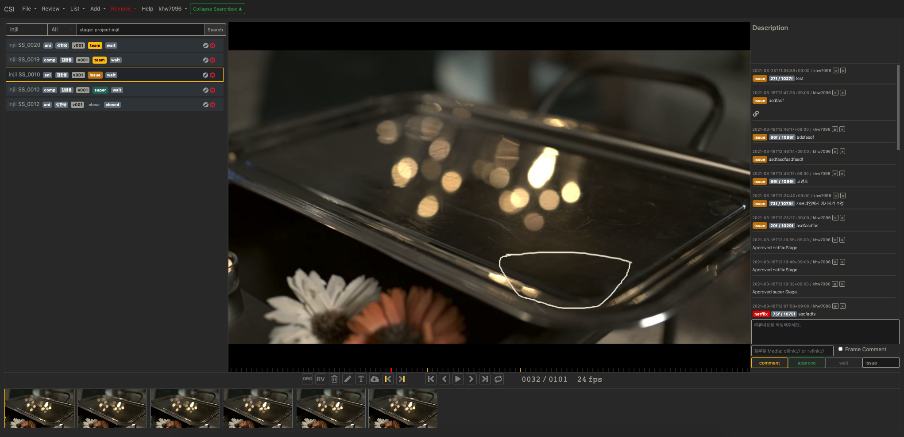
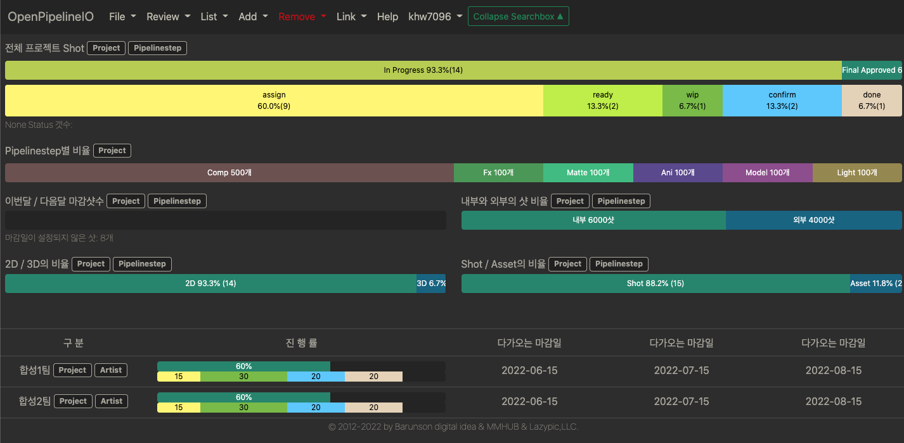

# OpenPipelineIO

[](https://goreportcard.com/report/github.com/lazypic/OpenPipelineIO)






OpenPipelineIO는 영화, 드라마, 전시영상, 애니메이션, 게임 등 콘텐츠 제작을 위한 프로젝트 매니징 솔루션, DATA IO 솔루션 입니다.
업무에 대해 파이프라인을 구분짓고 설정할 수 있다는 것은 한 조직에서 초기 설정된 정보를 활용하여, 프로젝트 진행, 부분 자동화, 완전 자동화, 빅데이터 단계, AI 단계를 준비할 수 있음을 의미합니다.

- 속도, 검색어 방식, 교육의 최소화, 단일파일 배포를 중점으로 개발되고 있습니다.
- 내부, 외부 서버에 설치가 가능합니다.
- 리뷰 시스템
- 사용자별 토큰키, 암호화키, 직급별 접근권한 사용이 가능합니다.

## Roadmap

브라우저 지원 우선순위: 크롬 > 사파리 > 파이어폭스

1. 파트너 관리툴 추가 - 진행중
1. 통계, 레포트 - 진행중
1. 달력, 간트챠트 <https://fullcalendar.io> - 진행중
1. InBox 구조: 메시지, 팔로우 기능: <https://github.com/gorilla/websocket>
1. 장비관리 툴
1. 소프트웨어 등록, 환경변수 관리 -> JWT토큰 정보를 uri로 보내는 형태의 웹프로토콜
1. 샷 파일 브라우져
1. Data Mining: Machine learning을 위한 데이터 수집
1. Machine learning(AI) 조직의 보안 및 프라이버시를 위해 데이터를 섞어서 학습시키지 말것.
1. [Collaborate with other open sources](https://landscape.aswf.io/?category=aswf-member-company&grouping=category&fullscreen=yes)

### 데이터베이스(mongoDB) 설치 및 서비스 실행

- [CentOS7에서 mongoDB 설정](https://github.com/cgiseminar/curriculum/blob/master/docs/install_mongodb.md)
- [데비안 리눅스에서 설지하기](documents/install_debian.md)
- [macOS에서 설치하기](documents/install_macOS.md)


### 간단하게 실행하기

```bash
openpipelineio -http :80 # 웹서버를 실행합니다.
openpipelineio -http :80 -reviewrender # 웹서버 및 FFmpeg를 이용하여 리뷰를 렌더링하는 서버
```

> 여러분이 macOS를 사용한다면 기본적으로 80포트는 아파치 서버가 사용중일 수 있습니다. 80포트에 실행되는 아파치 서버를 종료하기 위해서 `$ sudo apachectl stop` 를 터미널에 입력해주세요.

OpenPipelineIO는 [wfs-웹파일시스템](https://github.com/lazypic/wfs), [dilog-로그서버](https://github.com/lazypic/dilog), [웹프로토콜](https://github.com/lazypic/opio)과 같이 연동됩니다. 아래 서비스 실행 및 프로토콜 설치도 같이 진행하면 더욱 편리한 OpenPipelineIO를 활용할 수 있습니다.

```bash
dilog -http :8080
wfs -http :8081
```

### CentOS 방화벽 설정

다른 컴퓨터에서 접근하기 위해서는 해당 포트를 방화벽 해제합니다.

```bash
sudo firewall-cmd --zone=public --add-port=80/tcp --permanent
success
sudo firewall-cmd --reload
```

### CommandLine

터미널에서 간단하게 명령어를 통해 관리를 할 수 있습니다.

- [Item](documents/item.md): Asset, Shot
- [User](documents/user.md)
- [Daily](documents/daily.md)
- [Organization](documents/organization.md)

### RestAPI

OpenPipelineIO는 RestAPI가 설계되어 있습니다.
Python, Go, Java, Javascript, node.JS, C++, C, C# 등 수많은 언어를 활용하여 OpenPipelineIO를 제어할 수 있습니다.

- [Project](documents/rest_project.md)
- [Item](documents/rest_item.md): Asset, Shot
- [User](documents/rest_user.md)
- [Organization](documents/rest_organization.md)
- [Tasksetting](documents/rest_tasksetting.md)
- [Status](documents/rest_status.md)
- [Review](documents/rest_review.md)
- [Statistics](documents/rest_statistics.md)
- [Partner](documents/rest_partner.md)
- [ProjectForPartner](documents/rest_projectforpartner.md)
- [Money](documents/rest_money.md)
- [Moneytype](documents/rest_moneytype.md)
- [Step](documents/rest_step.md)
- [Pipelinestep](documents/rest_pipelinestep.md)
- [FullCalendar Event](documents/rest_fcevent.md)
- [FullCalendar Resource](documents/rest_fcresource.md)

### 썸네일 경로

위에서 생성된 thumbnail 폴더는 아래 구조를 띄고 있습니다.
썸네일은 사내 다른 응용프로그램에서도 사용될 수 있기 때문에 경로구조를 표기해둡니다.

- 썸네일주소 : `thumbnail/{projectname}/{id}.jpg`
- 사용자이미지 : `thumbnail/user/{id}.jpg`

### 프로젝트 Process

- [디자인 프로세스](documents/process_designer.md)
- [개발 프로세스](documents/process_developer.md)
- [Onset Setellite](documents/setellite.md)
- [DB관리](documents/dbbackup.md)

### Developer

- OpenPipelineIO: <https://openpipeline.io>
- Log서버: <https://openpipeline.io:8080>
- WFS서버: <https://openpipeline.io:8081>
- 회사 전용 빌드문의: hello@lazypic.org
- Maintainer: Jason / jason@lazypic.org
- Committer: Alex / alex@lazypic.org
- Contributors:
- 체험계정 ID/PW: guest
  - Guest 계정은 모든 메뉴가 보이지 않습니다.
  - Guest 계정은 일부 기능만 테스트 가능한 모드입니다.
  - 만약 많은 기능을 테스트하고 싶다면 가입한 ID와 함께 권한변경 요청메일을 hello@lazypic.org로 보내주세요.

### Infomation

- [OpenPipelineIO의 역사](documents/history.md)
- License: BSD 3-Clause License

### License

- OpenPipelineIO: BSD 3-Clause License
- [JScolor](http://jscolor.com/download/): GNU GPL license v3
- [Dropzone](https://www.dropzonejs.com): MIT License
- [JQuery](https://jquery.org/license/): MIT license
- [VFS](https://github.com/blang/vfs): MIT license
- [HttpFS](https://github.com/shurcooL/httpfs): MIT license
- [VFSgen](https://github.com/shurcooL/vfsgen): MIT license
- [Excelize](https://github.com/360EntSecGroup-Skylar/excelize): BSD 3-Clause License
- [Slack go webhook](https://github.com/ashwanthkumar/slack-go-webhook): Apache License, Version 2.0
- [Captcha](https://github.com/dchest/captcha): Apache License, Version 2.0
- [Mgo](https://github.com/go-mgo/mgo): <https://github.com/go-mgo/mgo/blob/v2-unstable/LICENSE>
- [JWT go](https://github.com/golang-jwt/jwt): MIT license
- [OpenColorIO](https://github.com/AcademySoftwareFoundation/OpenColorIO): BSD 3-Clause License
- [alfg/mp4](https://github.com/alfg/mp4): MIT license
- [amarburg/go-quicktime](https://github.com/amarburg/go-quicktime): MIT license
- [Gollia Mux](https://github.com/gorilla/mux): BSD 3-Clause License
